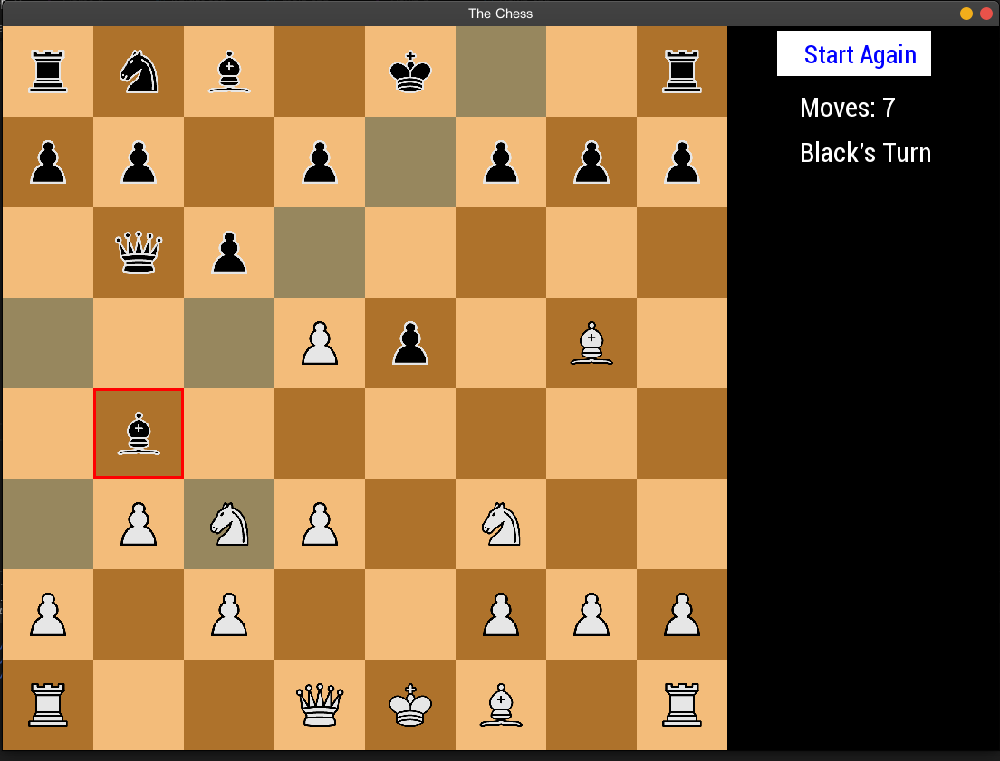

# Chess-Game

This project is the C++ implementation of Player vs Player Chess Game in C++ using SFML graphics Library. 
Not yet complite

  

 ## Setting up SFML on Linux

 ```
 $ sudo apt-get install libsfml-dev
 ```
 
## Steps to run this program

1. Clone the repository:
   ```
   $ git clone https://github.com/Boualili-Youcef/Projects/tree/main/Chess-Game-master
   ```

2. Navigate to the project directory:
   ```
   $ cd Chess-Game
   ```

3. Create a build directory:
   ```
   $ mkdir build
   ```

4. Navigate to the build directory:
   ```
   $ cd build
   ```

5. Run CMake to configure the project:
   ```
   $ cmake ..
   ```

6. Build the project:
   ```
   $ make
   ```

7. Run the program:
   ```
   $ ./ChessGame
   ```

## Project Structure

- `src/`: Contains the source code files.
- `build/`: Directory where the project is built.

## Dependencies

- SFML (Simple and Fast Multimedia Library)


